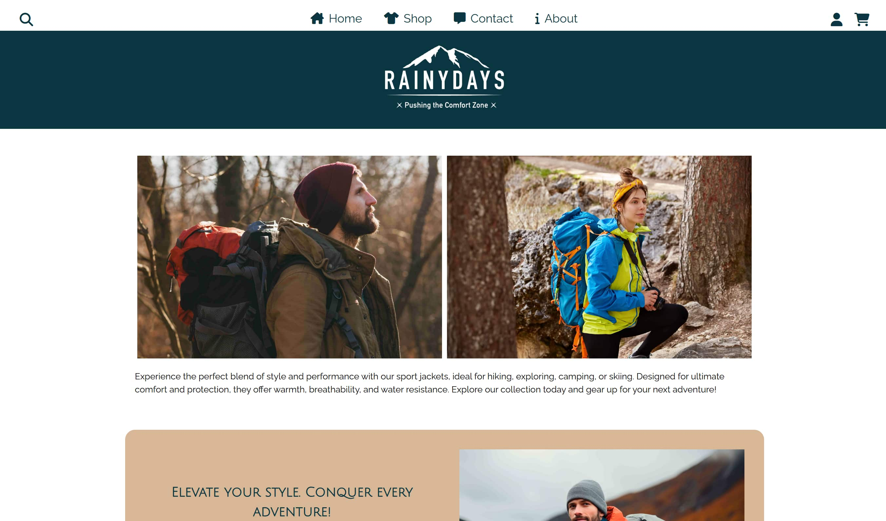
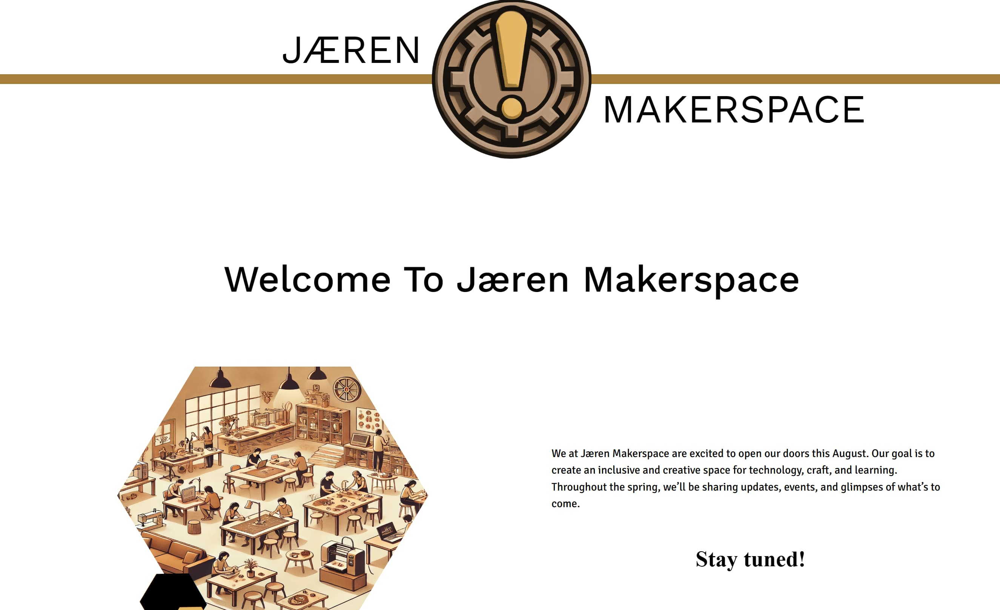
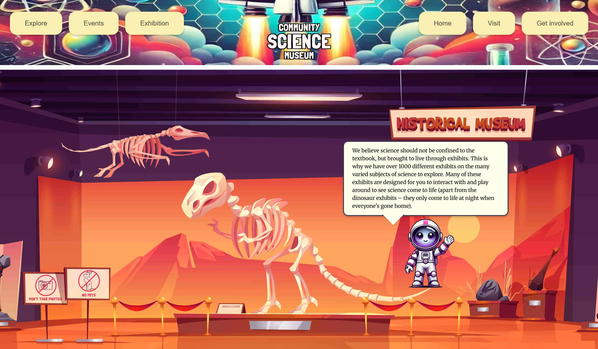
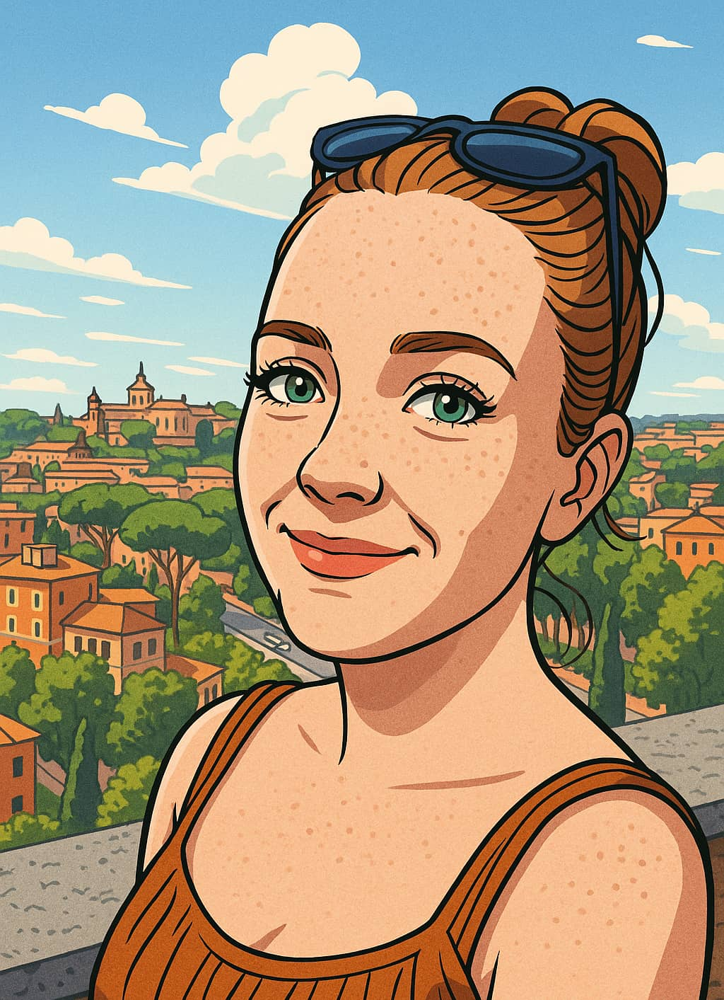

# Malin Skrettingland Portfolio [Live site](https://portfolio-malin-malin.netlify.app/)

A modern, responsive personal portfolio website showcasing projects from Noroff Front-End Development studies (2024–2026).

<p align="center">
  
</p>

I'm always pushing myself to be more organized and learn new things. I've never made an arch thumbnail before, but I loved the experience!

## Features

- Clean, elegant, and fun design with a light beige/cream and dark green palette
- Stylish header with custom logo
- "About Me" section
- Two types of project cards:
  - Classic (arch style)
  - Teaser/thumbnail (image-dominant, responsive)
- Visually distinct, responsive project sections
- Prominent images with text overlays
- Contact section
- Fully responsive: adapts beautifully to desktop, tablet, and mobile

## Showcase

### About Me (Sample Text)

> "I am passionate about creating beautiful, accessible web experiences. My portfolio is a reflection of my journey as a front-end developer, blending creativity with code.

## Earlier Projects

Here are some of my earlier projects from my studies:

| Project            | Preview Image                                   | Link                                                                      |
| ------------------ | ----------------------------------------------- | ------------------------------------------------------------------------- |
| RainyDays          |                | [RainyDays](https://rainy-days-malin.netlify.app/)                        |
| Exam 2025          |                  | [Exam 2025](https://courageous-stroopwafel-073cc9.netlify.app/)           |
| Semester Project 1 |  | [Semester Project 1](https://community-science-museum-malin.netlify.app/) |

## Folder Structure

```
index.html
CSS/
  archCard.css
  footer.css
  globalStyleSheet.css
  header.css
  logo.css
  thumbnail.css
  variable.css
image/
  ...project and profile images...
```

## Technologies Used

- HTML5
- CSS3 (custom properties, flexbox, media queries)

## Credits

Portfolio design and code by Malin Skrettingland.

<p align="center">
  
</p>
