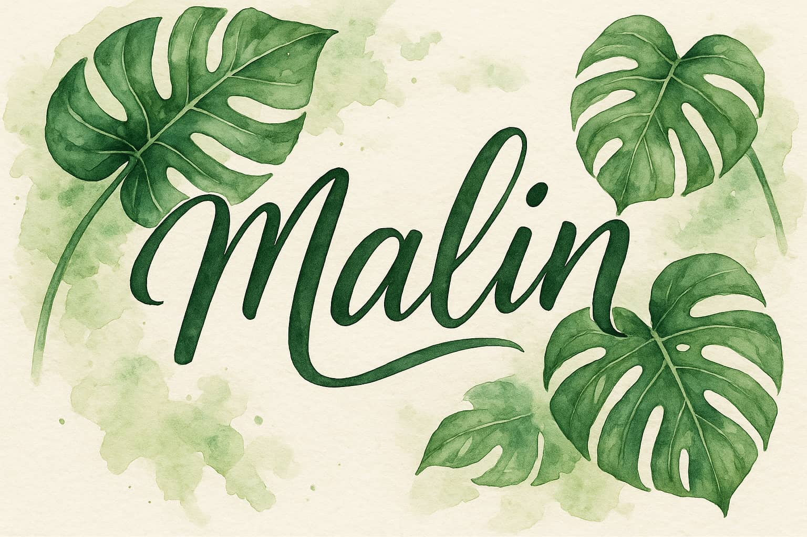
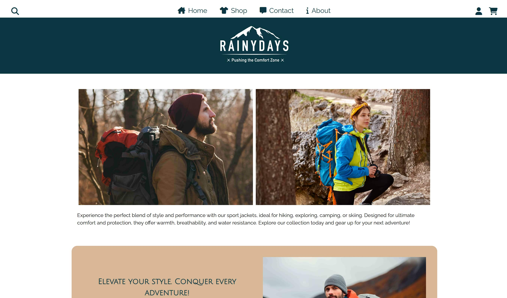
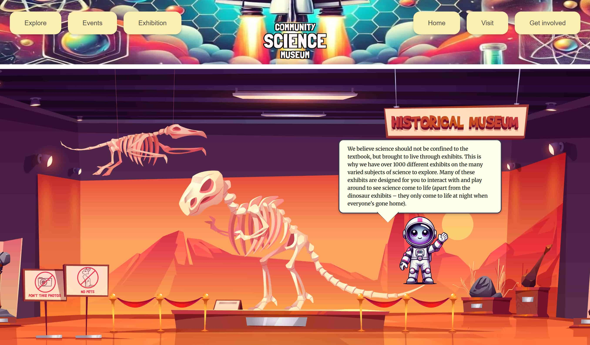
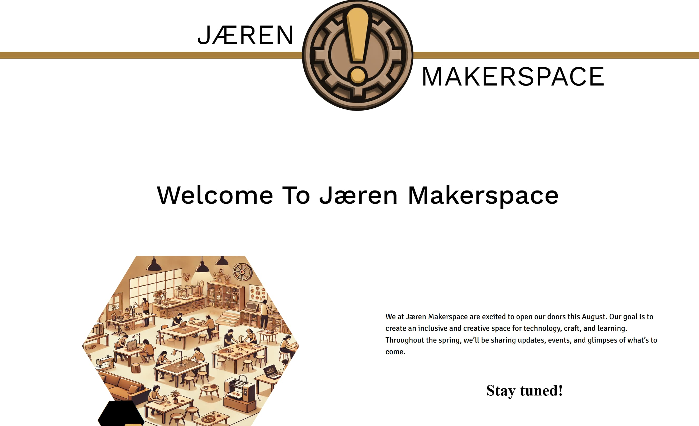
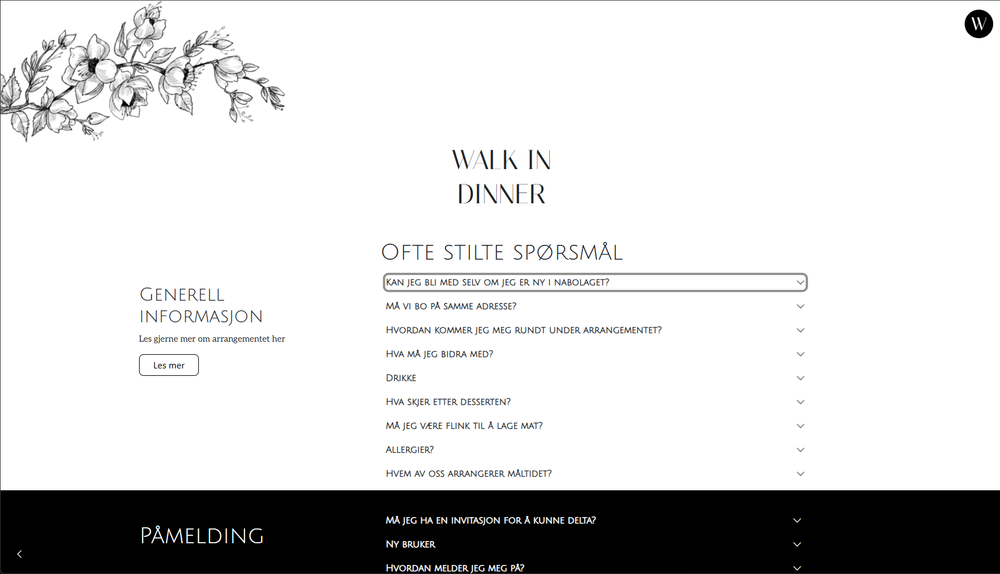
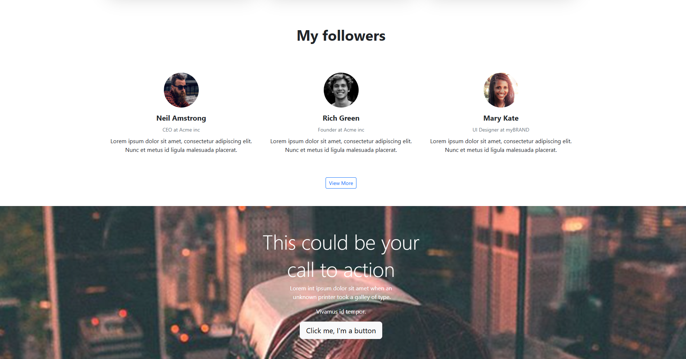
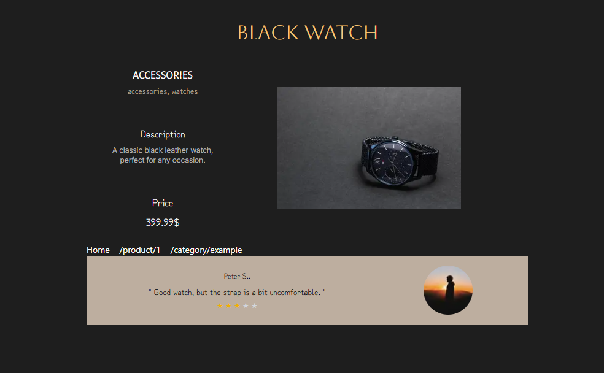
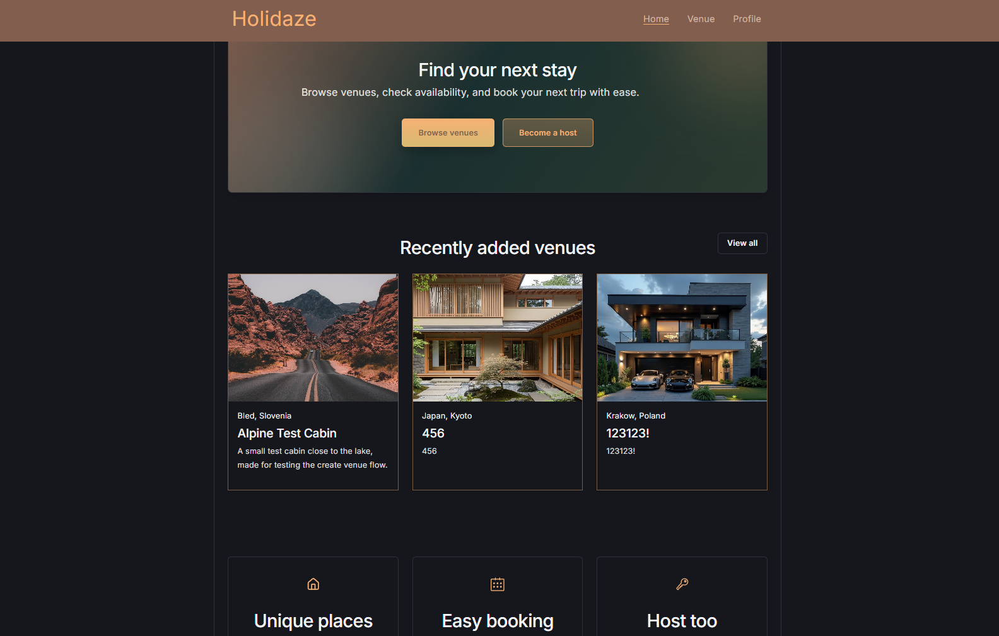

# Malin Skrettingland Portfolio

[Live site](https://portfolio-malin-malin.netlify.app/)

A modern, responsive React portfolio showcasing projects from Noroff Front-End Development studies (2024-2026).

  

## Features

- React + TypeScript + Vite setup
- Responsive layout for desktop, tablet, and mobile
- Reusable project card components
- Project details page with links to live site, Figma, and GitHub
- Custom styling with a personal visual identity

## Project Showcase

| Project                  | Preview                                                      | Live                                                        |
| ------------------------ | ------------------------------------------------------------ | ----------------------------------------------------------- |
| The RainyDays            |                        | [Open](https://rainy-days-malin.netlify.app/)               |
| Community Science Museum |  | [Open](https://community-science-museum-malin.netlify.app/) |
| Jaeren Makerspace        |                 | [Open](https://courageous-stroopwafel-073cc9.netlify.app/)  |
| Walk in Dinner           |           | [Open](https://walk-in-dinner.netlify.app/)                 |
| Social Media             |                 | [Open](https://sosial-media-application.netlify.app/)       |
| Skretcher                |                        | [Open](https://genuine-sundae-0c12fa.netlify.app/)          |
| Holidaze (new)           |                          | [Open](https://holidaze-ms.netlify.app/)                    |

## Install And Run Locally

### Requirements

- Node.js 20+ (recommended)
- npm

### Setup

1. Clone the repository.
2. Install dependencies:

   npm install

3. Start development server:

   npm run dev

4. Open the local URL shown in the terminal (usually http://localhost:5173).

### Other Scripts

- Build production bundle:

  npm run build

- Preview production build:

  npm run preview

- Run linting:

  npm run lint

## Technologies Used

- React 19
- TypeScript
- Vite
- React Router
- CSS3

## Credits

Portfolio design and code by Malin Skrettingland.

  

